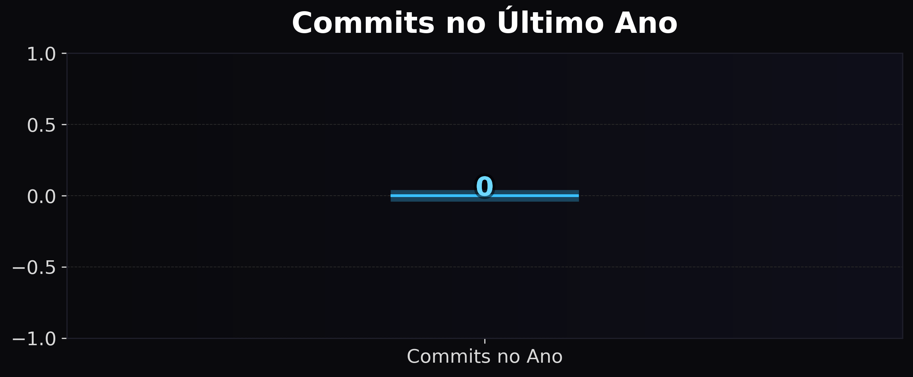

## Estatísticas do Repositório

# github-stats-generator

Gerador automático de imagens SVG/PNG com estatísticas do GitHub.

## Objetivo
Gerar `assets/github-stats.png` e `assets/github-stats.svg` diariamente via GitHub Actions e disponibilizar a imagem para uso no README / GitHub Pages.

## Como usar
No seu README ou site, inclua:
[GitHub Stats](output/github-stats.png) com ! no ínicio do bloco, para que a imagem apareça (como a primeira imagem).

## Configuração
- Edite `generate_stats.py` caso queira alterar layout/tema.
- Action roda diariamente; você pode disparar manualmente em **Actions → Generate GitHub Stats**.
