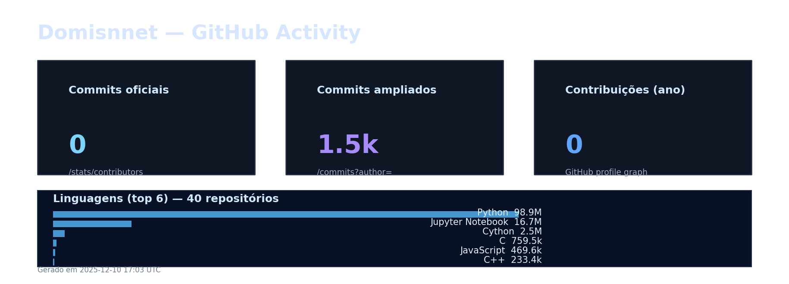

<h2 id="sobre-o-projeto">1. GitHub Stats Generator - Automação Visual 📊</h2>


[](https://github.com/Domisnnet/GitHub-Stats-Generator/blob/main/LICENSE)

<div align="center">
  <br />
  <strong>Automação Avançada de Estatísticas — Visualização Premium em Tempo Real</strong>
  <br /><br />
  
</div>

Gráfico atualizado e refatorado por: **actions-user**

<br />

Bem-vindo ao **GitHub Stats Generator**! Um projeto de engenharia de dados automatizado que coleta métricas da conta `Domisnnet` e gera visualizações profissionais com design *high-tech*. Esqueça atualizações manuais; aqui, o dado flui do servidor para o gráfico diariamente de forma totalmente autônoma.

---

## 📚 Tabela de Conteúdo

| 📊 O Projeto | 🛠️ Técnico | 🤝 Comunidade |
| :---: | :---: | :---: |
| [](#sobre-o-projeto) | [](#destaques-tecnicos) | [](#codigo-fonte) |
| [](#tecnologias-utilizadas) | [](#estrutura-do-projeto) | [](#créditos) |
| [](#como-rodar-localmente) | [](#como-contribuir) | [](#licenca) |
| [](#funcionalidades) | [](#faq) | [](#perfil-do-github) |

---

<h2 id="tecnologias-utilizadas">2. ⚙️ Tecnologias Utilizadas</h2>

| Camada | Tecnologias | Descrição |
| :--- | :--- | :--- |
| **Linguagem** |  | Core do sistema para coleta e processamento de dados. |
| **Automação** |  | Workflow CI/CD para execução diária agendada (Cron). |
| **Visualização** |  | Engine gráfica para geração do dashboard premium. |
| **Integração** |  | Extração de métricas de repositórios e commits. |

---

<h2 id="como-rodar-localmente">3. 🚀 Como Rodar Localmente</h2>

Deseja testar o gerador no seu ambiente? Siga os comandos:

```bash
# 1. Clone o repositório
git clone [https://github.com/Domisnnet/github-stats-gnr](https://github.com/Domisnnet/github-stats-gnr)

# 2. Instale as dependências
pip install -r requirements.txt

# 3. Execute o gerador manualmente
python generators/generate_commits.py
```

---

<h2 id="funcionalidades">4. 🧩 Funcionalidades Principais</h2>

O pipeline executa um ciclo autônomo de inteligência e design:

| Funcionalidade | Descrição |
| :--- | :--- |
| 🤖 **Workflow Autônomo** | Execução automática via GitHub Actions todos os dias às 00:00 UTC. |
| 📊 **Dashboard Tech** | Geração de gráficos com gradientes, neon glow e estilo Dark Mode premium. |
| 📈 **Análise de Linguagens** | Cálculo percentual das tecnologias mais utilizadas nos repositórios. |
| 🕒 **Timeline de Commits** | Coleta da atividade semanal dos últimos 12 meses via API. |
| 💾 **Auto-Commit** | O sistema salva a nova imagem e atualiza o repositório sem ação humana. |

---

<h2 id="destaques-tecnicos">5. 💻 Destaques Técnicos</h2>

O projeto foi construído com foco em **Python Moderno** e **Clean Architecture**:

### 📐 Design de Dashboard via Código
Diferente de ferramentas prontas, este projeto utiliza o `Matplotlib` de forma avançada. O módulo `plot_theme.py` aplica patches de bordas arredondadas (`FancyBboxPatch`) e gradientes verticais, criando uma estética de aplicação desktop premium em uma imagem estática.

### 🔄 Integração Assíncrona e Segura
A coleta de dados é modularizada. O script principal não conhece as regras da API; ele apenas solicita os dados ao módulo `github_api.py`, garantindo que o código seja fácil de manter, testar e escalar.

---

<h2 id="estrutura-do-projeto">6. 📂 Estrutura do Projeto</h2>

```text
github-stats-generator/
│
├── .github/workflows/
│   └── generate_stats.yml   # Automação com GitHub Actions
│
├── generators/
│   └── generate_commits.py  # Script principal de geração do gráfico
│
├── utils/
│   ├── github_api.py        # Módulo de integração com a API do GitHub
│   └── plot_theme.py        # Tema visual premium do gráfico
│
├── output/
│   ├── github-stats.png     # Estatística gerada (auto)
│   └── .gitkeep             # Mantém a pasta versionada
│
└── requirements.txt         # Dependências do projeto
```

---

<h2 id="como-contribuir">7. 🤝 Como Contribuir</h2>

Deseja melhorar o design ou adicionar novas métricas? Siga o fluxo oficial:

| Fase | Ação | Link / Comando |
| :---: | :--- | :--- |
| **01** | **Fork** | [](https://github.com/Domisnnet/GitHub-Stats-Generator/fork) |
| **02** | **Branch** | `git checkout -b feature/NovoGrafico` |
| **03** | **Commit** | `git commit -m 'feat: add gráfico de estrelas'` |
| **04** | **Push** | `git push origin feature/NovoGrafico` |
| **05** | **PR** | [](https://github.com/Domisnnet/GitHub-Stats-Generator/compare) |

---

<h2 id="faq">8. 🧠 Perguntas Frequentes</h2>

<details>
<summary><strong>Como a imagem se atualiza sozinha ❓</strong></summary>
<p>🤖 <strong>Resposta:</strong> O arquivo <code>generate_stats.yml</code> instrui o GitHub a "acordar" um servidor virtual todo dia, rodar o script Python e salvar a imagem de volta no repositório.</p>
</details>

<details>
<summary><strong>Posso usar para meu perfil ❓</strong></summary>
<p>✅ <strong>Resposta:</strong> Sim! Basta clonar e alterar a variável <code>username</code> no código principal para o seu login do GitHub.</p>
</details>

<details>
<summary><strong>O script precisa de Token de Acesso ❓</strong></summary>
<p>🔑 <strong>Resposta:</strong> Para rodar no GitHub Actions, utilizamos o <code>GITHUB_TOKEN</code> nativo do ambiente, garantindo segurança sem expor chaves no código.</p>
</details>

---

<h2 id="codigo-fonte">9. 💻 Código Fonte</h2>

Deseja analisar a lógica de coleta de dados? Explore o código-fonte:

[](https://github.com/Domisnnet/GitHub-Stats-Generator)

---

<h2 id="créditos">10. 📝 Créditos & Reconhecimentos</h2>

O **GitHub Stats Generator** é o resultado de automação inteligente e design:

| Atribuição | Responsável / Recurso | Descrição |
| :--- | :--- | :--- |
| **Engenharia de Dados** | **DomisDev** | Desenvolvimento do pipeline, lógica Python e automação. |
| **Engine Gráfica** | **Matplotlib** | Base para renderização estatística de alta qualidade. |
| **Data Provider** | **GitHub API** | Fonte primária de dados e métricas de contribuição. |
| **Apoio Técnico** | **Google Gemini** | Padronização King-Domfy e refinamento documental. |

---

<h2 id="licenca">11. 📄 Licença</h2>

Este projeto está licenciado sob a [](https://github.com/Domisnnet/GitHub-Stats-Generator/blob/main/LICENSE)

---

<h2 id="perfil-do-github">12. 👨‍💻 Perfil do GitHub</h2>

<a href="https://github.com/Domisnnet"> 
     
</a>
